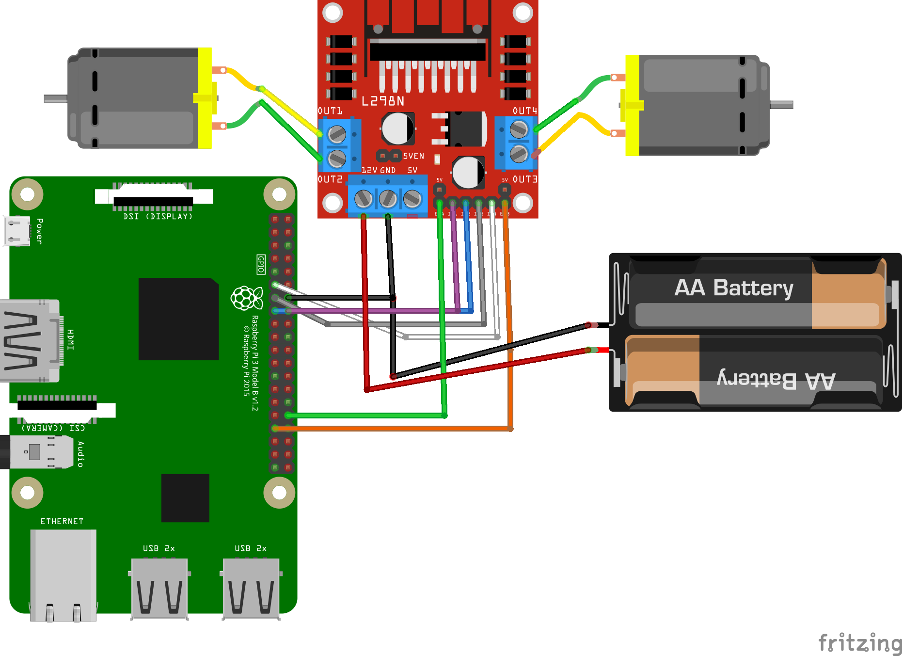

# Автономный автомобиль-робот на Raspberry Pi

Автономный автомобиль-робот с рулевым механизмом Аккермана, использующий лазерный дальномер, инерциальный модуль и энкодеры для самостоятельной навигации в ограниченном пространстве. Управление осуществляется посредством ROS

## 1. Перечень комплектующих (Аппаратная часть робота)

Бортовой компьютер: Raspberry Pi 3 B+

Драйвер двигателей: L298N H-bridge

Питание: Li-lion аккумулятор 3.6V (4 шт.)
  
Мотор: R130 motor (2 шт.)

Датчики положения:

- Лазерный дальномер VL53L0X
- Инерциальный модуль GY-91

Энкодеры: FC-03 (2 шт.)

## 2. Схема подключения
Робот построен по принципу рулевого механизма Аккермана, который используется в реальных автомобилях. Данный рулевой механизм обеспечивает поворот внутреннего переднего колеса на немного более острый угол, чем внешнего, тем самым устраняя
проскальзывание шин, вызванное геометрическими особенностями.

**Схема подключения носит упрощённый характер и не отражает всех особенностей реального подключения**

## 3. Программная часть
- Используется Ubuntu Server 22.04.5 на Raspberry Pi.

- Установлен и настроен ROS Noetic для работы с сенсорами и управления движением.

## 4. Ориентация в пространстве и навигация

- Для определения положения используется комбинация данных с акселерометра, гироскопа и магнитометра модуля GY-91.

- Для измерения расстояния до препятствий используется лазерный дальномер VL53L0X.

- Система будет оценивать пройденный путь с помощью интеграции ускорения (одометрия на основе IMU) и корректировать ошибки с учётом данных с дальномера.

- В будущем планируется интеграция алгоритмов фильтрации (например, фильтра Калмана) для более точного отслеживания положения.
